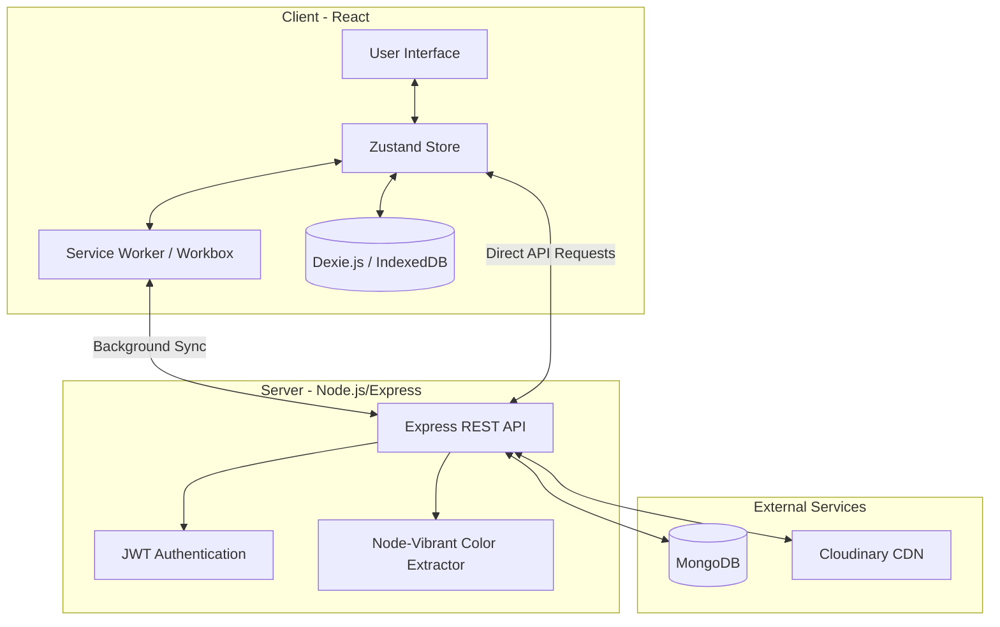

<div align="center">
  
  <h1 align="center">Note.js - Modern Notes Application</h1>
  <p align="center">
    A full-stack, highly resilient, offline-first note-taking application.
    <br />
    <br />
    <a href="#-key-features">Features</a>
    ·
    <a href="#-architecture-flowchart">Architecture</a>
    ·
    <a href="#-getting-started">Deployment</a>
  </p>
</div>

---

## 🌟 Highlights

> **Note.js** isn't just another note-taking app. It's built with a robust **offline-first architecture** ensuring your thoughts are never lost, even when your connection is. Combined with intelligent dynamic theming, it offers a personalized, seamless, and highly aesthetic experience.

---

## ✨ Key Features

- 🏢 **Enterprise-Grade Offline Architecture**: Built with a highly resilient, offline-first system using `Dexie.js`, `Workbox`, and Service Workers. The application functions flawlessly without an internet connection. Create, edit, delete, and restore notes locally, and let the custom sync engine seamlessly reconcile all changes with the cloud once your connection is restored!
- ♻️ **Intelligent Recycle Bin**: Accidentally deleted a note? No problem. The advanced Recycle Bin acts as a safe haven. View, restore, or permanently empty them, fully integrated with the offline-first architecture. Additionally, a background cron job automatically cleans up notes that have been in the recycle bin for over 30 days!
- 🎨 **Dynamic Theming with Node-Vibrant**: Upload a background image via your profile, and the backend automatically extracts a custom color palette (main, accent, and secondary accent colors) using `node-vibrant`. The frontend applies this custom palette across all UI elements for a personalized aesthetic.
- 🌓 **Dark & Vibrant Mode**: Toggle between a deeper dark mode and a lighter vibrant mode, dynamically adapting the interface and background overlay to match your custom color palette.
- 💾 **Auto Save**: Notes are automatically saved as you type, so you never lose your train of thought.
- 📱 **Mobile-Optimized UI**: Fully responsive and tailored for all devices. Features a smooth, collapsible Hamburger Menu, adaptive grid layouts, and touch-friendly targets.
- 🪞 **Glassmorphism Aesthetics**: A modern UI design featuring translucent components, backdrop blurs, and sleek glowing hover shadows.
- 🔒 **Secure Image Storage**: Profile avatars and backgrounds are uploaded securely using Cloudinary.

---

## 🛠️ Tech Stack

<div align="center">
  
  
  
  
  
  
  
</div>

---

## 🗺️ Architecture Flowchart

Below is a high-level flowchart depicting how the frontend, backend, and external services interact, especially highlighting the offline-first approach.



---

## 🚀 Getting Started

Follow these detailed step-by-step instructions to deploy Note.js locally on your machine.

### Prerequisites

Ensure you have the following installed and set up before you begin:
- **[Node.js](https://nodejs.org/)** (v16 or higher recommended)
- **[Git](https://git-scm.com/)**
- A **MongoDB URI** (You can get a free cluster on [MongoDB Atlas](https://www.mongodb.com/cloud/atlas))
- **Cloudinary Credentials** (Sign up for free at [Cloudinary](https://cloudinary.com/))
- **Resend API Key** (Optional, for email functionalities)

### 1. Clone the Repository

First, clone the project to your local machine:

```bash
git clone https://github.com/your-username/Note.js.git
cd Note.js
```

*(Note: Replace the repository URL with the actual URL if different).*

### 2. Set Up the Backend

Open a new terminal window and navigate to the backend directory:

```bash
cd backend
```

Install the backend dependencies:

```bash
npm install
```

Create a `.env` file in the root of the `backend` folder and add the following environment variables:

```env
PORT=5001
MONGO_DB_URI=your_mongodb_connection_string
JWT_SECRET=your_jwt_secret_key
NODE_ENV=development

# Cloudinary Setup
CLOUDINARY_CLOUD_NAME=your_cloud_name
CLOUDINARY_API_KEY=your_api_key
CLOUDINARY_API_SECRET=your_api_secret

# Resend Email Setup
RESEND_API_KEY=your_resend_api_key
```

Start the backend server:

```bash
npm run dev
```

You should see a message indicating the server is running and connected to MongoDB.

### 3. Set Up the Frontend

Open another new terminal window and navigate to the frontend directory:

```bash
cd frontend
```

Install the frontend dependencies:

```bash
npm install
```

*(Optional)* If you need to configure the backend API URL for the frontend, create a `.env` file in the `frontend` directory:

```env
VITE_API_URL=http://localhost:5001
```
*(Note: Adjust depending on your Vite config and backend port).*

Start the frontend development server:

```bash
npm run dev
```

### 4. Open the Application

Once both servers are running, open your browser and navigate to the URL provided by Vite (usually `http://localhost:5173`).

---

## 🤝 Acknowledgements

- Huge shout out to [Rajdeep Das](https://github.com/rajdeepcodeshere247) for the amazing suggestions to implement the auto save functionality and the dark/light mode toggle!
