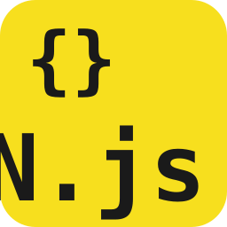
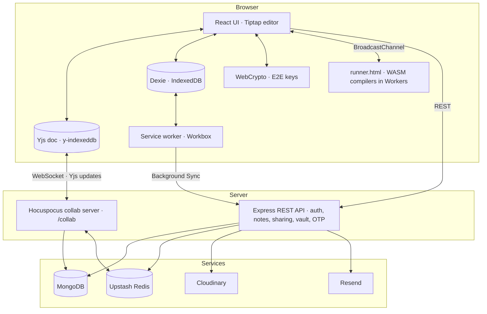

<div align="center">
  
  <h1 align="center">Note.js</h1>
  <p align="center">
    An offline-first, real-time collaborative workspace for notes, code and mathematics,<br />
    with end-to-end encryption and a code runner that works without a server.
    <br />
    <br />
    <a href="https://www.notejs.in/"><strong>Live app</strong></a>
    ·
    <a href="#-features">Features</a>
    ·
    <a href="#-architecture">Architecture</a>
    ·
    <a href="#-getting-started">Getting started</a>
  </p>
</div>

---

## 🌟 Highlights

- **Works offline, syncs later.** Every change is written to IndexedDB first, so the app opens and edits with no connection and catches up on its own.
- **Edit together, live.** Notes are shared Yjs documents: several people type in the same note at once and see each other's cursors.
- **Private when it matters.** Any note can be end-to-end encrypted in the browser; the server then only ever stores ciphertext.
- **Code that runs.** Code blocks open in a real editor that formats, lints and runs C, C++, Java, Go, Python, JavaScript and TypeScript, compiled to WebAssembly in the browser, offline.
- **Math by keyboard.** Write LaTeX, or type equations visually (`a/b`, `sqrt`, `x^2`) without knowing LaTeX.
- **Three themes, one layout.** Common, JavaScript and Pythagoras, each in light and dark.

---

## ✨ Features

### ✍️ Writing

- **Rich-text editor** built on Tiptap: headings, lists, tables, images, alignment, inline code and code blocks.
- **Mathematics**
  - Type `$a^2+b^2=c^2$` and it becomes an equation as you close the `$`; `$$` + space on an empty line makes a display equation.
  - **Ctrl/Alt + M** inserts an equation in the line, **Ctrl/Alt + Shift + M** one on its own line, or use the **x²** and **∑** toolbar buttons.
  - The **visual editor** (MathLive) turns `a/b` into a fraction, `sqrt` into √, `alpha` into α; arrow keys move out of the equation back into the text. A **LaTeX tab** shows the source with a live preview, and an on-screen math keyboard helps on touch devices.
  - Equations render with KaTeX everywhere, including note previews, and are stored as plain LaTeX so they survive sync, sharing and search.
- **Code blocks with a full editor** (CodeMirror 6), opened by double-clicking a block or **Ctrl/Alt + Shift + C**:
  - Syntax highlighting, linting and auto-indent for 14 languages.
  - **Format** with Prettier, clang-format, gofmt or Ruff, all compiled to WebAssembly.
  - **Run** C, C++, Java, Go, Python, JavaScript and TypeScript with stdin and output panels, plus a live HTML preview. Programs are compiled and run as WebAssembly in an isolated page (no network, capped CPU, memory and output), and compilers are cached so code still runs offline.
- **Autosave** as you type, and a recycle bin that keeps deleted notes for 30 days.

### 🤝 Collaboration & sharing

- **Real-time co-editing** over a Hocuspocus (Yjs) WebSocket server, with live cursors labelled by name and colour.
- **Share by email** with roles: **admin**, **editor** or **viewer**, and change or revoke access at any time.
- **Link sharing**: keep a note restricted, or let anyone signed in with the link open it as an editor or viewer.
- Edits made offline merge cleanly when you reconnect, because Yjs updates are conflict-free (CRDT).

### 🔐 Security & privacy

- **End-to-end encryption, per note**, using only the browser's WebCrypto:
  - A 6-digit PIN is stretched with PBKDF2 (600,000 iterations) and HKDF into keys that never leave the device.
  - Each user has an ECDH P-256 identity key; its private half is stored on the server only in wrapped (encrypted) form.
  - Each encrypted note has its own random AES-GCM 256 key, wrapped separately for every member, so only people on the note can read it.
  - Every ciphertext is bound to its note, key version and purpose, so the server can't swap blobs between notes.
  - Share links for encrypted notes carry the key after `#`, which browsers never send to the server.
  - Removing someone and rotating the key means they can't read anything written afterwards.
- **JWT sessions with instant revocation**: logging out puts the token on a server-side blocklist (MongoDB TTL index), so a stolen token stops working immediately.
- **Google sign-in** and **email + password with OTP verification** (Resend).
- **Rate limiting** on sensitive routes (Upstash Redis).
- **HTML sanitised on both sides** with DOMPurify allowlists, and a strict Content Security Policy that only loads self-hosted scripts, fonts and images.

### 📶 Offline-first

- Notes live in **IndexedDB** (Dexie) and the UI reads from there, so everything is instant and keeps working offline.
- A **sync engine** pushes queued changes to MongoDB when the connection returns; Workbox **Background Sync** retries them even after the tab is closed.
- The **service worker** precaches the app shell, fonts, formatters and math libraries; the app installs as a PWA.
- Signing out with unsynced notes warns first instead of silently dropping them.

### 🎨 Themes

Every theme has a light and a dark mode, keeps the same layout, and changes colours, type, artwork and even the app's wording.

| Theme | Look | Extras |
| --- | --- | --- |
| **Common** | Calm paper and ink, from Kamisaka Sekka's woodblock prints (1909). Plain-language labels for everyone. | Helpful tips in the status bar |
| **JavaScript** | The original IDE: title bar as `console.log`, notes as `.js` files, colours pulled from your wallpaper with node-vibrant. | A **console** with commands (`ls`, `touch`, `rm`, `gotchas`…), a JS history timeline, the Konami code |
| **Pythagoras** | A geometer's drafting table (graph paper by day, blueprint by night) in Oliver Byrne's colours from his 1847 Euclid. | An animated proof of a² + b² = c², a **Pythagorean triple finder** that inserts equations into notes, optional monochord sounds tuned to Pythagorean ratios, a chronology of the theorem, and a hidden 3-4-5 easter egg |

You can also upload your own wallpaper, which replaces the theme's artwork.

### ⌨️ Keyboard shortcuts

| Keys | Action |
| --- | --- |
| Ctrl+N / Alt+N | New note (anywhere) |
| Ctrl+T / Alt+T | Jump to the title |
| Ctrl+Shift+T / Alt+Shift+T | Jump to the content |
| Ctrl+Shift+C / Alt+Shift+C | Open the code editor |
| Ctrl+M / Alt+M | Equation in the line |
| Ctrl+Shift+M / Alt+Shift+M | Equation on its own line |
| Ctrl+D | Move the open note to the bin |
| Ctrl+Shift+X | Close the open note |

Browsers keep some Ctrl shortcuts for themselves in a normal tab; the Alt versions always work, and the Ctrl ones work in the installed app.

---

## 🛠️ Tech stack

<div align="center">
  
  
  
  
  
  
  
  
  
  
  
  
</div>

| Area | Tools |
| --- | --- |
| Frontend | React 19, TypeScript, Vite, Tailwind CSS 4, Zustand, React Router |
| Editor | Tiptap 3, Yjs + y-indexeddb, CodeMirror 6, KaTeX, MathLive, Prism |
| Code tools | @wasm-oj toolchains (Clang, Go, Java, Python, JS) on Wasmer, Prettier, clang-format, gofmt, Ruff (WASM) |
| Offline | Dexie (IndexedDB), Workbox service worker, Background Sync, PWA |
| Backend | Node.js, Express, Hocuspocus collaboration server, MongoDB / Mongoose |
| Security | WebCrypto (PBKDF2, HKDF, ECDH P-256, AES-GCM), JWT, DOMPurify, Upstash rate limiting |
| Services | Cloudinary (images), Resend (email), Google OAuth, Upstash Redis, Vercel |

---

## 🗺️ Architecture


```mermaid
graph TD
    subgraph Browser
        UI[React UI · Tiptap editor]
        Y[(Yjs doc · y-indexeddb)]
        IDB[(Dexie · IndexedDB)]
        SW[Service worker · Workbox]
        WC[WebCrypto · E2E keys]
        RUN[runner.html · WASM compilers in Workers]

        UI <--> Y
        UI <--> IDB
        UI <--> WC
        UI <-->|BroadcastChannel| RUN
        IDB <--> SW
    end

    subgraph Server
        API[Express REST API · auth, notes, sharing, vault, OTP]
        COLLAB[Hocuspocus collab server · /collab]
    end

    subgraph Services
        DB[(MongoDB)]
        REDIS[(Upstash Redis)]
        CDN[Cloudinary]
        MAIL[Resend]
    end

    UI -->|REST| API
    SW -->|Background Sync| API
    Y <-->|WebSocket · Yjs updates| COLLAB
    API --> DB
    COLLAB --> DB
    COLLAB <--> REDIS
    API --> REDIS
    API --> CDN
    API --> MAIL
```

- **Plain notes** sync through the collaboration server, which stores the Yjs state in MongoDB and keeps an HTML copy for previews and search. Redis relays updates between server instances.
- **Encrypted notes** never reach the server as plaintext: the browser encrypts each Yjs update before it leaves, and the server stores and relays ciphertext only.
- **The code runner** lives on its own cross-origin-isolated page (`runner.html`), because WebAssembly threads need `SharedArrayBuffer`; isolating the whole app would break Google sign-in.

---

## 🚀 Getting started

### Prerequisites

- [Node.js](https://nodejs.org/) 20.19+ or 22.12+ (required by Vite 8), and [Git](https://git-scm.com/)
- A MongoDB connection string ([MongoDB Atlas](https://www.mongodb.com/cloud/atlas) has a free tier)
- [Cloudinary](https://cloudinary.com/) credentials (image uploads)
- An [Upstash](https://upstash.com/) Redis database (rate limiting and the collaboration relay)
- A [Resend](https://resend.com/) API key (sign-up and PIN-reset emails)
- A Google OAuth client ID (Google sign-in)

### 1. Clone

```bash
git clone https://github.com/banerjee2080/Notes_app.git
cd Notes_app
```

### 2. Backend

```bash
cd backend
npm install
```

Create `backend/.env`:

```env
PORT=5001
NODE_ENV=development
APP_URL=http://localhost:5173

MONGO_DB_URI=your_mongodb_connection_string
JWT_SECRET=a_long_random_string

# Collaboration server
COLLAB_PORT=1234
COLLAB_TOKEN_SECRET=a_long_random_string

# End-to-end encryption / OTP secrets
VAULT_SERVER_SECRET=a_long_random_string
OTP_TOKEN_SECRET=a_long_random_string

# Google sign-in
GOOGLE_CLIENT_ID=your_google_client_id

# Upstash Redis (rate limiting + collab relay)
UPSTASH_REDIS_REST_URL=your_upstash_rest_url
UPSTASH_REDIS_REST_TOKEN=your_upstash_rest_token
# REDIS_URL=rediss://...   optional: any other Redis for the collab relay

# Cloudinary
CLOUDINARY_CLOUD_NAME=your_cloud_name
CLOUDINARY_API_KEY=your_api_key
CLOUDINARY_API_SECRET=your_api_secret

# Resend (email)
RESEND_API_KEY=your_resend_api_key
```

Start the API and the collaboration server in two terminals:

```bash
npm run dev
```

```bash
npm run collab:dev
```

### 3. Frontend

```bash
cd frontend
npm install
```

Create `frontend/.env`:

```env
VITE_GOOGLE_CLIENT_ID=your_google_client_id
# VITE_COLLAB_URL=ws://localhost:1234   optional: defaults to /collab, which Vite proxies
```

```bash
npm run dev
```

Open `http://localhost:5173`. Vite proxies `/api` to the API on port 5001 and `/collab` to the collaboration server on port 1234, so the app uses the same URLs as in production.

### 4. Deploy

The repository deploys to **Vercel** as is (`vercel.json`): the frontend is built from `frontend/`, while `backend/Server.js` and `backend/collab.js` run as Node functions. Add the backend variables in the Vercel project settings.

---

## 📁 Project structure

```
backend/
  Server.js            Express API entry
  collab.js            Hocuspocus collaboration server
  src/
    collab/            Editor schema (must match the frontend's) and access checks
    controllers/       auth, notes & sharing, encryption, vault (PIN), OTP
    lib/               sanitiser, token blocklist, mailer, vault secrets
    middleware/        auth and rate limiting
    models/            User, Note, NoteUpdate, blocked tokens
frontend/
  runner.html          Isolated page that compiles and runs code
  src/
    components/        editor, math, code editor, Pythagoras tools, app shell
    lib/               sync engine, crypto, themes, lore, math loaders
    pages/             home, note, bin, profile, history, auth
    runner/            WebAssembly toolchains for the code runner
    serviceWorker/     Workbox service worker
    stores/            Zustand stores (auth, vault, sync, UI, theme)
```

---

## 🤝 Acknowledgements

- Huge shout-out to [Rajdeep Das](https://github.com/rajdeepcodeshere247) for suggesting autosave and the dark/light toggle.
- Theme artwork is public domain or CC0: Kamisaka Sekka's *Momoyogusa* (Rijksmuseum), Oliver Byrne's *The First Six Books of the Elements of Euclid* (1847), and Raphael's *The School of Athens*. Sources are listed in [`frontend/public/themes/CREDITS.md`](frontend/public/themes/CREDITS.md).
